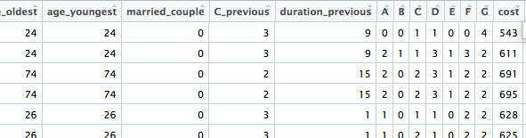

# Allstate Purchase Prediction Challenge 

## 1. Usage:
1. Source main.R, classifier.R and write.prediction.R respectively

2. Change directory in the three files as needed

## 2. Project Description: 
### 2.1 Background: 
Allstate group initiated a Purchase Prediction Challenge on Kaggle on 2014. Below is the challenge description from [Kaggle page](https://www.kaggle.com/c/allstate-purchase-prediction-challenge):

As a customer shops an insurance policy, he/she will receive a number of quotes with different coverage options before purchasing a plan. This is represented in this challenge as a series of rows that include a customer ID, information about the customer, information about the quoted policy, and the cost. Your task is to predict the purchased coverage options using a limited subset of the total interaction history. If the eventual purchase can be predicted sooner in the shopping window, the quoting process is shortened and the issuer is less likely to lose the customer’s business. 
Using a customer’s shopping history, can you predict what policy they will end up choosing?

### 2.2 Goal:

One customer may quote several times before buying a car insurance policy. Each quote is a row in train/test dataset. The difference between quotes are things they changed. It includes their demographic information and/or their coverage option. For example, they may provide additional information on car value. They may also change their deductible amount. 

There are a total of seven coverage options (A, B, C, D, E, F and G) that needs to be predicted. Each coverage option has multiple (2, 3 or 4) possible values. Below shows several rows of the data frame. 

 

The goal of this project is to correctly predict values for all seven coverage options in all customers in test dataset. All seven predictions needs to be correct in order to count competitors’ accuracy in leaderboard. 
### 2.3 Significance: 

From the perspective of insurance company, this challenge tried to predict what coverage option a customer will buy based on their quote history. 

This prediction is important because it allows insurance company:

1. Guess what customer may like. This information can be used for recommendation. A good recommendation increases the number of people who buy Allstate’s insurance. 

2. If the recommendation performs well in early stage of quote, customer would spend much less time to buy a insurance in Allstate and thus increase the company profitability.

### 2.4 Explorative analysis
[Two datasets](http://www.kaggle.com/c/allstate-purchase-prediction-challenge/data) were provided: train.csv and test.csv 

Each row represents one quote. One customer could have multiple quotes. To distinguish quotes within one customer. the variable shopping_point was used, Their demographic information and their coverage option were recorded in each row. Each column contains one demographic information or coverage option.

By analyzing the distribution of last shopping point number, we knew the shape of train dataset is different from test set. See below (Figure credit [Kevin Markham](https://github.com/dpei/Allstate_purchase_prediction))
 

This is so because the test dataset was truncated to make the problem more challenge. 

From forum discussion, it’s widely accepted that using last quote coverage options is an effective way to predict coverage option they purchase. The accuracy of using this method is 68%. Thus, this is used as baseline method.

#### 2.4.1 Which option do we change?
Firstly, by checking the change of accuracy after correct one specific option (out of seven). We got the number below

if all correct all letter A: 0.702367821542331

if all correct all letter B: 0.708305414961498

if all correct all letter C: 0.708934222597903

if all correct all letter D: 0.699605191270913

if all correct all letter E: 0.703079095754002

if all correct all letter F: 0.703388345411251

** if all correct all letter G: 0.768794647919265**

These data shows that changing G only lead to a 10% increase in prediction. Which makes G a great option to start with. 

When checking the change of accuracy after correct two specific options (out of seven) simutenousely. Correctly predicting two letters (G+letter) would increase ~2% (data not shown). The number is not a very big increase. Thus the prediction focused mainly on changing G.

#### 2.4.2 Whose G?
The next step is to subset individuals that has more potential to be corrected on their G. In order to find the answer, a plot was generated to show the accuracy of prediction in by different last shopping_point number. 

 

From the figure, we know that people with 2 shopping point (people that only quote twice before buying an insurance) is worst in prediction the purchased option. As people have more shopping point in the training data, the accuracy increase. As a result, it is better to focused on changing G in people with small number of shopping points.

The next thing to know is to answer the question how much percent increase in difference shopping point groups. The result is below. 

 

From the result, each group increase 7-10%. This percentage is not extremely high in certain shopping point groups. This percentage is slightly decrease as shopping point increase. This result made us to know that change G in people with low shopping point is a way worth pursuing (8-10% increase).

#### 2.4.3 Add a new feature: num.change (how many demographic feature changed)

When explore the train dataset, the demographic data was shown to change among different shopping points. This was explained by people adding or removing information while they do another quote (data not shown). With this information in mind, I explored if people that changed more demographic features are more likely to change G? 

To answer this question, I generated a new feature called “num.change”. It is defined as the number of features that was changed across different quotes. I explored if people with higher num.change are having a higher probability to change their G option. If that’s the case, it will be useful to add this feature into our training dataset. Below is the result. 

 

Since the overall G change percentage in all training individuals is 13%. This percentage is higher as num.change goes higher. Thus, I added this feature into the training dataset.

### 2.5 Methods:

1. Preprocess the train dataset: Only people with 2 or 3 shopping point were listed in train dataset. Each individual only has one record. This record was originated from the last shopping point. A new feature called num.change was generated.

2. Remove features: "shopping_pt”, "record_type", "time", "C_previous" (too many NA), "location" and "risk_factor”.

3. Majority vote for GBM, random forest and SVM. All three were using default parameters. This model was only applied to people with 2,3 or 4 shopping point in test dataset.

4. Iterate over several combinations to determine which shopping point to use as train and which people to use as test.

### 2.6 Result

The baseline method itself is pretty good in predicting final purchase option. 
It has accuracy of 53.793% in public board. The accuracy of the winner is 54.403%. My method got 53.978%.

 

A total of 1568 teams joined the challenge. The winner team increased only a modest amount of prediction accuracy. It suggests that the information provided in train dataset may not be enough to facilitate a significant increase in the prediction accuracy.

